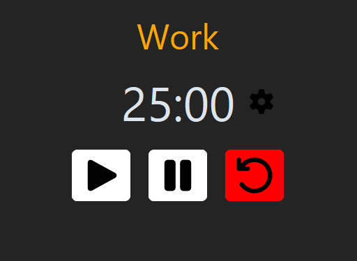

# Pomoly

Pomoly is a simple Pomodoro style desktop productivity app built with Python.

It helps users stay focused by alternating between Work and Break sessions with notifications and sound alerts. 

***This is a development-friendly project that can be freely modified and extended.***


## Features

- Work / Break cycle timer
- Automatic session switching
- Desktop notifications 
- Sound alerts
- Adjustable session durations
- Pause / Resume / Reset controls
- Settings window 


## Preview




## Installation

```bash
git clone https://github.com/khalafoff/Pomoly.git
cd Pomoly
pip install -r requirements.txt
```


## Run

```bash
python main.py
```


## Requirements

- Python 3.10+
- customtkinter
- winotify
- playsound3
- Pillow


## Limits

- Minimum time: 1 minute
- Maximum time: 60 minutes


## How it works

Pomoly uses a simple state machine:

Work mode >> Break mode

Break mode >> Work mode

Timer automatically switches sessions when reaching 0
